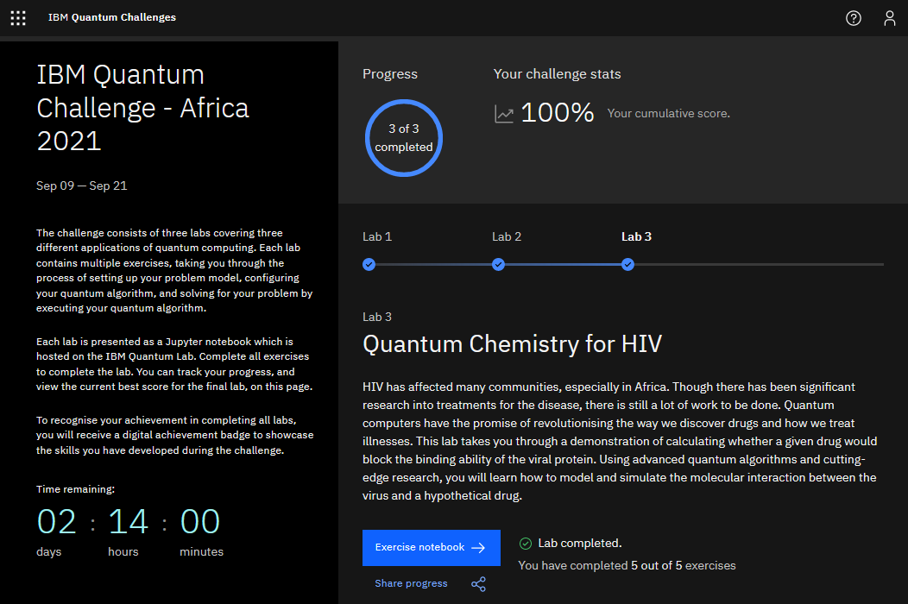
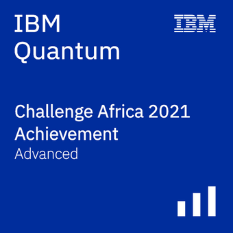

# IBM Quantum Challenge Africa 2021  
  
These are the solutions I submitted for the [IBM Quantum Challenge Africa 2021](https://medium.com/qiskit/ibm-quantum-challenge-africa-how-african-researchers-are-building-a-quantum-community-from-the-5e524f623a99)  
The original challenge repository is at [/qiskit-community/ibm-quantum-challenge-africa-2021](https://github.com/qiskit-community/ibm-quantum-challenge-africa-2021)  
  
## Challenge Details  
__Site:__ [ibm.co/ibmQuantumAfrica21](https://ibm.co/ibmQuantumAfrica21)  
__Date:__ September 2021  
  
## Certificate  
Here's a screenshot of my challenge portal dashboard.  
  
  
And here's my advanced badge, for completing all the exercises.  
  
  
## Description  
The challenge consisted of 3 exercises, in each `lab*` folder.  
Each folder has a `readme.md` introduction, a `.ipynb` workbook, and a `.html` copy of the workbook.  
There are also several pictures in the folders, used in the workbooks.  
  
## Topics  
[`lab1`](lab1/lab1.ipynb) - Quadratic Optimisation -- for Farming  
[`lab2`](lab2/lab2.ipynb) - Quantum Monte Carlo -- for Finance  
[`lab3`](lab3/lab3.ipynb) - Variational Quantum Eigensolver -- for Protein Binding  